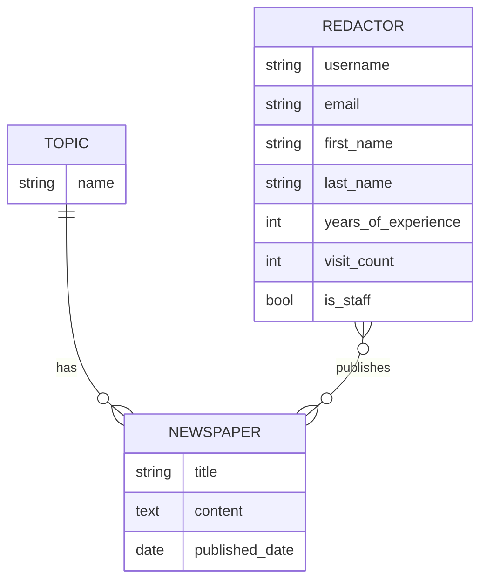

# Newspaper Agency

A Django web application for managing a newspaper agency's editorial
workflow: topics, newspapers, and the redactors (editors) who publish
them.

## Description

You are the editor-in-chief of a newspaper agency. This project helps
track which redactors are responsible for each newspaper issue, so it's
always clear who published what.

## Live Demo
You can view the live version of this project at: [https://newspaper-agency-vo7n.onrender.com](https://newspaper-agency-vo7n.onrender.com)

## Test Credentials for Demo:
SIMPLE USER
  Login: test_user
  Password: password123qwerty

REDACTOR USER
  Login: admin
  Password: 12345qwert

### Features

- Full CRUD for Topics, Newspapers, and Redactors.
- Custom user model (`Redactor`) extending Django's `AbstractUser` with
  a `years_of_experience` field.
- Public sign-up: anyone can register an account to browse content.
- Access control: only staff users (redactors) can create, edit, or
  delete Topics, Newspapers, and Redactors. Regular registered users
  can browse and search, but not modify data.
- Search by name/title/username on every list page.
- Clickable topics that filter the newspaper list by topic.
- Session-based visit counter on the dashboard.
- Custom Bootstrap-based UI with a consistent color palette and an SVG
  background illustration.

### DB structure



## Installation

Python 3 and Git must already be installed.

```shell
git clone https://github.com/MykolaLozanDevelopment/newspaper-agency.git
cd newspaper-agency
python -m venv venv
source venv/bin/activate   # on Windows: venv\Scripts\activate
pip install -r requirements.txt
python manage.py migrate
python manage.py runserver
```

## Testing

```shell
python manage.py test
```

## Code style

The project follows PEP8 and is checked with flake8:

```shell
flake8
```
